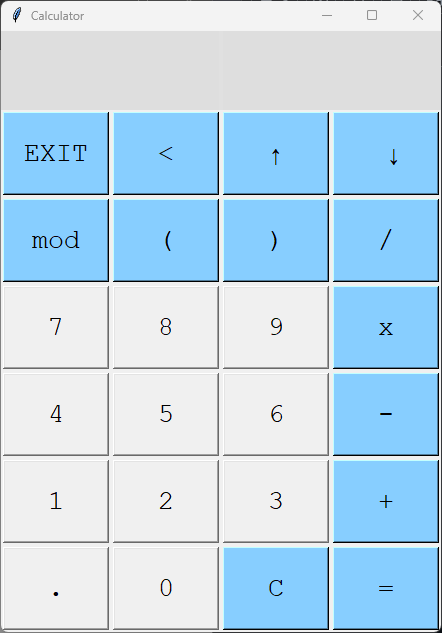

<p align="center">  </p>

# Calculator

A simple calculator.

## Software Requirements 

```
- Python 3.13.0
- SQLite 3.46.1
```

## Usage 

Instructions on how to use calculator are included below.

### Downloading

Here, we will cover downloading the calculator to your local machine.

To download the calculator, enter the following command in the terminal:
```
git clone https://www.github.com/ntjennings1/calculator.git
```

Open the command prompt and enter your chosen home directory of the project.
```
cd $CALC_HOME
```

### Execution

Here, we will cover invoking the calculator once it is on your local machine.

Some environments may require a virtual environment. Once inside $CALC_HOME, users can create one with this command:
```
python -m venv venv
```

Then activate the virtual environment with this:
```
.\venv\Scripts\activate
```

OR with this on Linux distributions:
```
source ./venv/bin/activate
```

Run the calculator.

```
python src/main.py
```

## Acknowledgements

```
Noah Jennings 
	ntjennings1@gmail.com
	Virginia Beach,VA 
```
